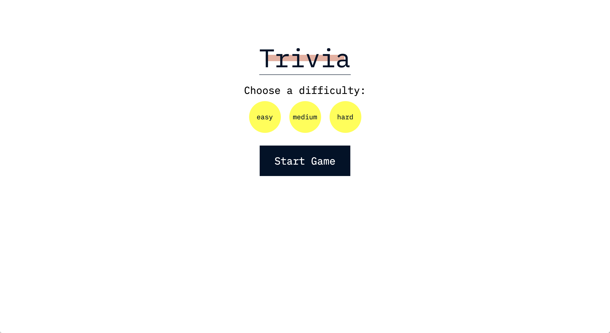
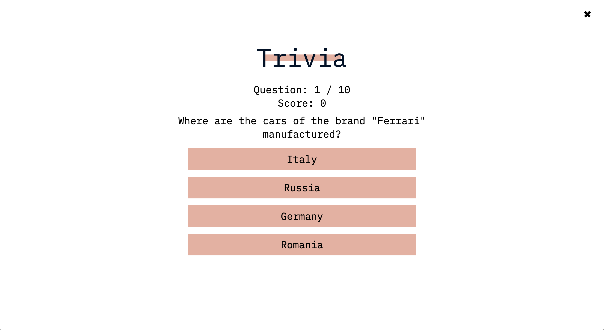

# Trivial Trivia  🍰  
Refine your trivia skill.

 |  
:-------------------------:|:-------------------------:
Landing Page | Question Card

## Instructions
Clone repo from the **source** branch and run 🚀 `yarn start`. Open [http://localhost:3000](http://localhost:3000) to play.

## Resources
* Built with 👋 ⚛️ [React](https://reactjs.org/docs/create-a-new-react-app.html) utilizing the tutorial from [freeCodeCamp.org](https://www.youtube.com/watch?v=F2JCjVSZlG0).
* UI Designs inspired by the ✨ [Tandem Website](https://madeintandem.com/).
* Powdered by API from the 🔌 [Open Trivia Database](https://opentdb.com/).

## Reflections 
* Time spent: Research (Day 1), Skeleton code (Day 2), Styling & README (Day 3)
* Some potential future implementations are adding a scoreboard, UI/UX improvements (e.g, score and question tracker showing correct vs. incorrect questions), and the option to choose a category.
* Adding typescript to project (similar to the tutorial) and deploying to github-pages.

